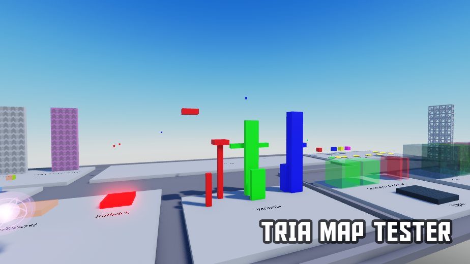

## TRIA MAP STUDIO TESTER

> A project that allows you to run TRIA maps in Roblox Studio.

Making maps isn't that easy, and testing makes it more difficult, and this project is the solution for you.

With this project, you can test your TRIA maps in Roblox Studio, and see how the map works in TRIA.os.

### Features

- Internal practice tools to help map makers test their maps.
- Directly test the map in studio instead of in TRIA.OS.

### Known Issues

- Inaccurate physics simulation in some cases

### How to use?

OR..watch this <a href="https://www.youtube.com/watch?v=xK5kZJeNXvc">Video</a> instead (Thank you, RockyTanker!)

1. Download the latest .rbxl file from the <a href="https://github.com/HarukaTea/TRIA-Map-Runner/releases">Releases</a> page.
2. Open the file in Roblox Studio.
3. Delete all the things under workspace.
4. Insert your own model and **UNGROUP** it
(MAKE SURE TO UNGROUP IT, OR THE MAP WILL NOT WORK PROPERLY)

5. Now, you can test the map!

