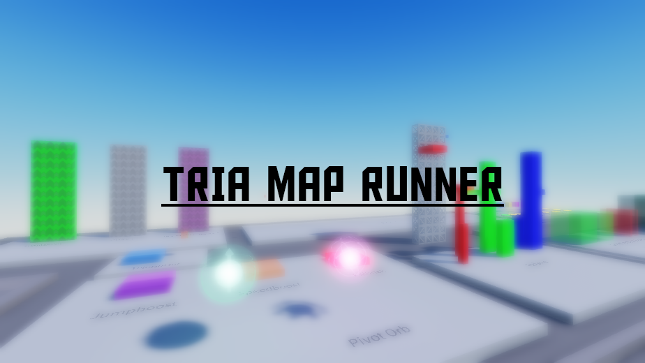

## TRIA地图测试工具

<a href="./README.md">English</a> | <u>简体中文</u>

> 一个能让你在Roblox Studio中测试TRIA地图的工具。

做TRIA地图并不容易，而测试也会让这个环节变得更加困难，因此，这个项目就是为了帮助地图制作者 测试他们的地图而创建的。

通过这个项目，你可以在Roblox Studio中运行你的TRIA地图。

你只需要作图就行了，而我考虑的可就多了。

### 亮点

- 内置练习工具
- 直接测试

### 已知的BUG

- 旧地图可能无法正常运行
- 在V1.0发布之前，物理参数可能不太准确

### 如何使用？

1. 在Releases里下载最新的.rbxl文件
2. 在Roblox Studio中打开这个文件
3. 删除workspace下所有的东西
4. 插入你的地图，记得 **UNGROUP**
5. 按F5测试

